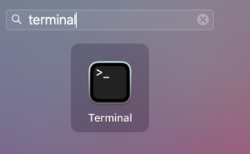
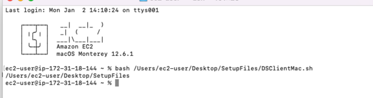

##  MAC Cihazlar İçin Kurulum

### 1- Gereksinimler

Dijital İmza uygulamasını cihazınıza kurmadan önce aşağıda belirtilen Java kütüphanesinin cihazınızda kurulu olması gerekmektedir.
JRE (Java Runtime Environment) . Bu kütüphaneyi aşağıdaki linkten cihaz türünüze uygun olanı seçerek indirebilirsiniz

İndirme sayfası : https://www.java.com/tr/download/manual.jsp

Yukarıdaki linkten Java'yı indirdikten sonra indirilenler klasörünüzde klasörünüzde görseldekine benzer bir kurulum dosyası olacaktır. Bu kurulum dosyasını açınız.


Bu kurulum dosyasını açtığınızda ilgili java paketi açılacaktır.


Bu paketi çift tılayarak açın.


Karşınıza çıkan bu ekranda open seçeneğini seçerek devam edin.


Install’a basarak kurulumu yapabilirsiniz.
Java kurulumu tamamlandıktan sonra Dijital İmza uygulamasının kurulumuna başlayabilirsiniz.

### 2- Dijital İmza Uygulamasının Kurulumu - Mac


Dijital İmza uygulamasının kurulumu için Mac cihazlarda bulunan terminal uygulamasından faydalanacağız.


Terminal uygulamasını açmak için LaunchPad'e girin.


Arama kısmına terminal yazın.



Gelen ekranda gördüğünüz terminal uygulamasını açın.


Karşınıza yukardaki görseldekine benzer gibi bir ekran gelecektir.

Bu ekranda şu komutu yazın :
```sh 
	bash
```

Ve bir boşluk bırakın

Ardından Setup Files klasöründeki DSClientMac.sh dosyasını tutup bu ekrana sürükleyin

```sh 
	bash /Users/username/Desktop/SetupFiles/DSClientMac.sh
```

Kod satırı yukardaki örneğe benzer şekilde görülecektir. Tek fark dosya konumunuz olacaktır.
Kod satırının sonudaki 1 adet boşluğu silmeniz gerekmektedir.
Ardından Entr'a basarak komutu uygulayın.



İşlem başarılı olması durumunda Terminal görüntüsü yukardaki görseldeki gibi olacak ve terminal bir alt satıra geçecektir.
Herhangi bir sorunla karşılaşmanız halinde program kendi işlem ve hata kayıtlarını oluşturmaktadır. Bu dosyalardaki kayıt mesajlarını iletmeniz durumunda sorunlarınız daha hızlı çözüme kavuşacaktır.


### 3 - Log Kayıtlarına  Nasıl Ulaşılır - Mac

Bu dosyalara erişmek için Cihazınızın masaüstünde bulunan diske erişin (Macintosh HD) bu disk adı sizin cihazınızda farklı olabilir.


Karşınıza çıkan bu ekranda Cmd + shift + . tuşlarına aynı anda basarak gizli klasörleri görünür hale getiriniz.


Gizli klasörleri görünür hale getirdiğinizde karşınıza görseldeki gibi bir ekran gelecektir.


Soluk renkli olarak görünen usr klasörünü açın.


Daha sonra local klasörünü açın.


Local klasörü içerisindeki bin klasörünü açın.


Bin klasöründe SetupFiles klasörünü bulun ve açın.

Setupfiles içerisinde “servicelog.err.log” dosyası mevcuttur.
Kurulum sırasında veya bilgisayarınızı yeniden başlattıktan sonra dijital imza servisi herhangi bir hata ile karşılaşırsa buraya kayıt edecektir.
Bu dosyayı çift tıklayarak text editör ile açabilirsiniz.

Programa ait hata dışı kayıtlar yine aynı klasörde bulunan “servicelog.out.log” dosyasında tutulmaktadır.


Dijital imza servisini  durdurmak zorunda kalırsanız  şu adımları izleyebilirsiniz.

Teminali açın
Servisi durdurmak için :  

```sh 
	sudo launchctl stop  com.dsclient.bms
```
komutunu uygulayın.

 
Servisi kaldırmak için durdurma komutunu uyguladıktan sonra
```sh 
	sudo launchctl unload  /Library/LaunchDaemons/com.dsclient.bms.plist
```
komutunu uygulayın.
